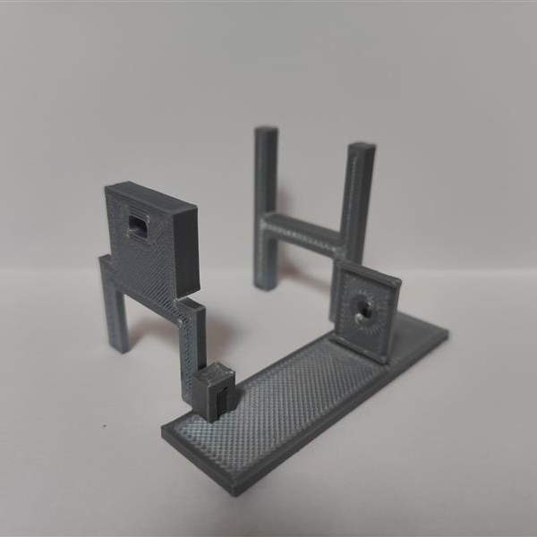
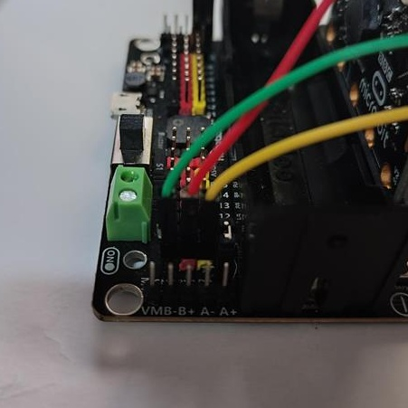

# Tester for robocar engine 

## What do you need?

 * Expansion board for micro:bit [link here](https://www.kittenbot.cc/products/robotbit-robotics-expansion-board-for-micro-bit)
 * Robot Gear Motor [link here](https://www.aliexpress.com/item/1005005305637407.html?spm=a2g0o.productlist.main.11.74bb7243tUCtq8&algo_pvid=281fa0cd-9826-4414-8b1f-51a81c4cb612&algo_exp_id=281fa0cd-9826-4414-8b1f-51a81c4cb612-5&pdp_npi=3%40dis%21CZK%2119.37%2115.09%21%21%21%21%21%402102169316858997196143750d075a%2112000032565020293%21sea%21CZ%210&curPageLogUid=yOTBheXgE40w)
 * Infrared Speed Sensor [link here](https://www.aliexpress.com/item/1005002206713739.html?spm=a2g0o.productlist.main.55.28252e2eVpOlhL&algo_pvid=cecdcf3e-5efe-46d1-ac4e-ddf79ea24c89&algo_exp_id=cecdcf3e-5efe-46d1-ac4e-ddf79ea24c89-27&pdp_npi=3%40dis%21CZK%2114.19%2111.03%21%21%21%21%21%4021227e5116858998050413808d07c6%2112000019274380689%21sea%21CZ%210&curPageLogUid=4UmKohN4y2jv)
 * Disc Encoder [link here](https://www.aliexpress.com/item/1005001710656130.html?spm=a2g0o.detail.1000060.1.546b71a6WvLHIa&gps-id=pcDetailBottomMoreThisSeller&scm=1007.13339.291025.0&scm_id=1007.13339.291025.0&scm-url=1007.13339.291025.0&pvid=d7ce17e9-3f56-4c41-91bc-61fda04eebc2&_t=gps-id:pcDetailBottomMoreThisSeller,scm-url:1007.13339.291025.0,pvid:d7ce17e9-3f56-4c41-91bc-61fda04eebc2,tpp_buckets:668%232846%238107%231934&pdp_npi=3%40dis%21CZK%2123.42%2120.72%21%21%21%21%21%402103253416858998296697400e5d52%2112000017248087367%21rec%21CZ%214141866426)
 * Screw with a diameter of 3 mm + nut + nut washer
 * The final price of the parts is around $25.40

## How to proceed

### Step 1: 
* download and print [parts](./pieces.zip) or [parts as STL](./piecesSTL.zip) using a 3d printer
* assemble as shown in the picture

### Step 2: 
* attach the sensor to the bracket
 

### Step 3:
* mount the engine on the structure

### Step 4:
* connect the sensor to the Expansion board on the P0 pin

### Step 5:
* connect the engine to the Expansion board on the M2 slot

### Step 6:
* upload the code to the micro:bit [CODE HERE](./microbit-pppp_motor_test.hex)
* you can take [code](./microbit-pppp_motor_test-asTextFile.txt) from the textfile
* make sure to use [this](https://github.com/TomasKazda/pxt-magicbit-pca9685/) extension

## How to use it

* press the A buttons on the micro:bit 
* the micro:bit display shows a number from 1 - 10 depending on the engine rotation speed
* when you connect microbit to [makecode](https://makecode.microbit.org/), you can see more information in the console

## Tip:
* if the engine doesn't start when the A button is pressed, you can turn the wheel a little in the direction of rotation and the engine should work normally(after pressing the A button there is a few seconds to do this)
