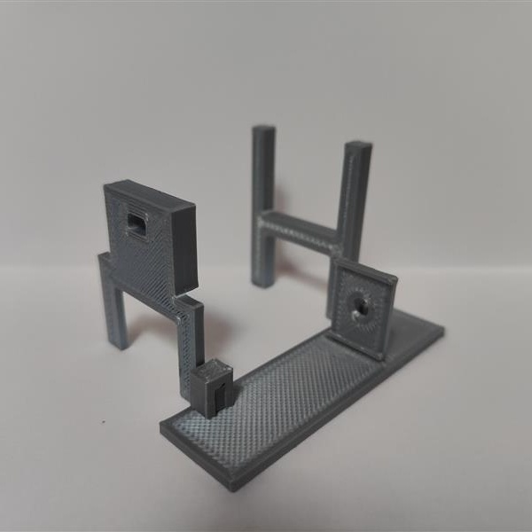
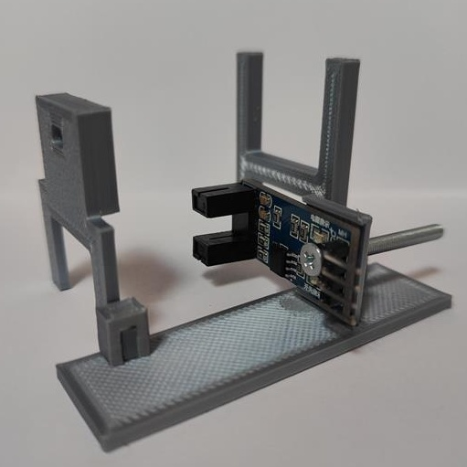
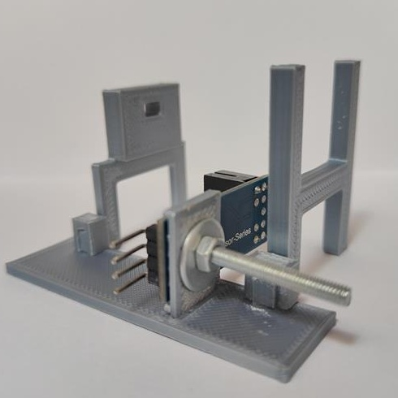
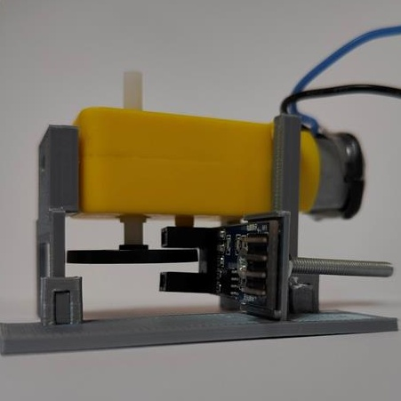
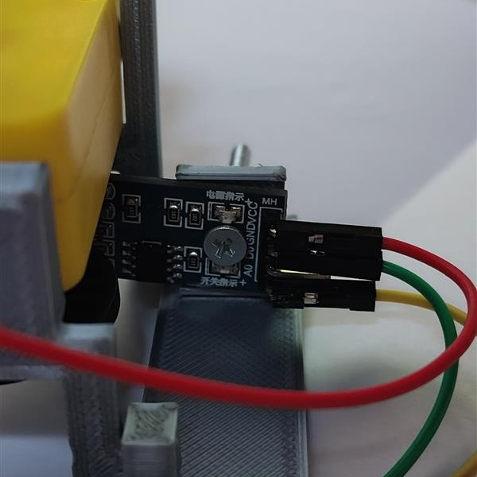
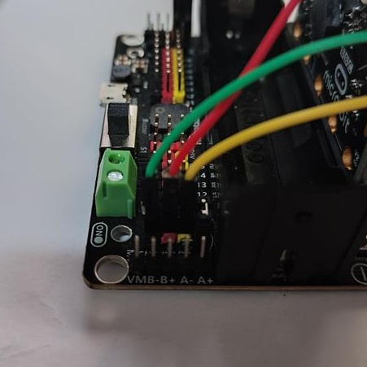
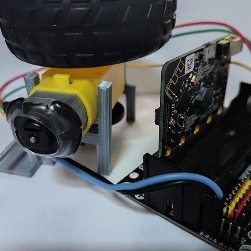

# Tester pro motor roboautomobilu 

## Co potřebujete?

* Rozšiřující deska pro micro:bit [odkaz](https://www.kittenbot.cc/products/robotbit-robotics-expansion-board-for-micro-bit)
* Robotický převodový motor [odkaz](https://www.aliexpress.com/item/1005005305637407.html?spm=a2g0o.productlist.main.11.74bb7243tUCtq8&algo_pvid=281fa0cd-9826-4414-8b1f-51a81c4cb612&algo_exp_id=281fa0cd-9826-4414-8b1f-51a81c4cb612-5&pdp_npi=3%40dis%21CZK%2119.37%2115.09%21%21%21%21%21%402102169316858997196143750d075a%2112000032565020293%21sea%21CZ%210&curPageLogUid=yOTBheXgE40w)
* Infračervený snímač rychlosti [odkaz](https://www.aliexpress.com/item/1005002206713739.html?spm=a2g0o.productlist.main.55.28252e2eVpOlhL&algo_pvid=cecdcf3e-5efe-46d1-ac4e-ddf79ea24c89&algo_exp_id=cecdcf3e-5efe-46d1-ac4e-ddf79ea24c89-27&pdp_npi=3%40dis%21CZK%2114.19%2111.03%21%21%21%21%21%4021227e5116858998050413808d07c6%2112000019274380689%21sea%21CZ%210&curPageLogUid=4UmKohN4y2jv)
* Kodér disků [odkaz](https://www.aliexpress.com/item/1005001710656130.html?spm=a2g0o.detail.1000060.1.546b71a6WvLHIa&gps-id=pcDetailBottomMoreThisSeller&scm=1007.13339.291025.0&scm_id=1007.13339.291025.0&scm-url=1007.13339.291025.0&pvid=d7ce17e9-3f56-4c41-91bc-61fda04eebc2&_t=gps-id:pcDetailBottomMoreThisSeller,scm-url:1007.13339.291025.0,pvid:d7ce17e9-3f56-4c41-91bc-61fda04eebc2,tpp_buckets:668%232846%238107%231934&pdp_npi=3%40dis%21CZK%2123.42%2120.72%21%21%21%21%21%402103253416858998296697400e5d52%2112000017248087367%21rec%21CZ%214141866426)
* Šroub o průměru 3 mm + matice + podložka pod matici
* Konečná cena dílů se pohybuje kolem 560Kč

## Jak postupovat

### Krok 1:
* stáhněte a vytiskněte [díly](./pieces.zip) nebo [díly jako STL](./piecesSTL.zip) pomocí 3d tiskárny
* sestavte podle obrázku

### Krok 2:
* připevněte snímač ke konstrukci
 

### Krok 3:
* připevnění převodovky na konstrukci

### Krok 4:
* připojte senzor k rozšiřující desce na pin P0.

### Krok 5:
* připojte motor k rozšiřující desce ve slotu M2

### Krok 6:
* nahrajte kód do micro:bitu [kód zde](./microbit-pppp_motor_test.hex)
* z textového souboru můžete vzít [kód](./microbit-pppp_motor_test-asTextFile.txt).
* nezapomeňte použít extension [this](https://github.com/TomasKazda/pxt-magicbit-pca9685/)

## Jak ji používat

* stiskněte tlačítko A na micro:bitu
* na displeji micro:bitu se zobrazí číslo od 1 do 10 v závislosti na rychlosti otáčení motoru
* když připojíte micro:bit k [makecode](https://makecode.microbit.org/) se v konzoli zobrazí další informace.

## Tip:
* pokud motor po stisknutí tlačítka A nezačne otáčet, můžete trochu otočit kolem ve směru otáčení a motor by měl normálně fungovat(po stisknutí tlačítka A na to máte několik sekund na provedení).
